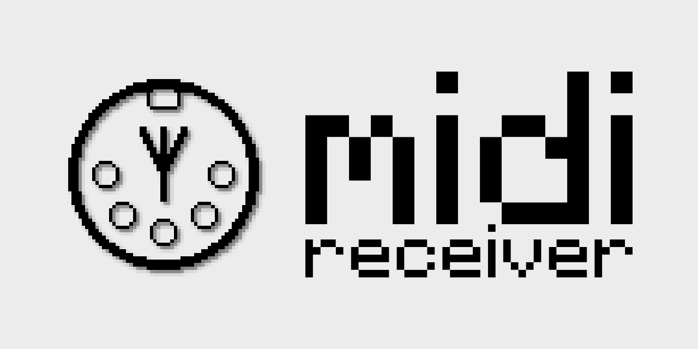

<!-- modrinth_exclude.start -->


[](LICENSE.md)

<!-- modrinth_exclude.end -->

# 🎼 MIDIReceiver (Spigot Plugin)

The **MIDIReceiver** plugin listens for `midi:action` plugin messages and plays matching Minecraft note block sounds in real time.

## 📡 Incoming Plugin Message: `midi:action`

The plugin receives `MidiAction` packets from the client mod and triggers sounds accordingly.

### `MidiAction` Payload Structure

```java
record MidiAction(
    String name,
    int command,
    int channel,
    int data1,
    int data2
)
```

| Field     | Type     | Description                          |
| --------- | -------- | ------------------------------------ |
| `name`    | `String` | Name of the MIDI device              |
| `command` | `int`    | MIDI command (e.g., `144` = Note On) |
| `channel` | `int`    | MIDI channel (0–15)                  |
| `data1`   | `int`    | Note number                          |
| `data2`   | `int`    | Velocity                             |

## 🔊 MIDI to Minecraft

If `command == 144` and `velocity > 0`, the plugin maps `data1` (MIDI note) to Minecraft note block pitch `0–24` and plays the note using `player.playNote(...)`.

## ✅ Requirements

* A Spigot/Paper server (1.20+ recommended)
* A client mod that sends `midi:action` plugin messages

---

Need help or want to contribute? Check out the [repository](https://github.com/uebliche/midireciever) or open an issue!
